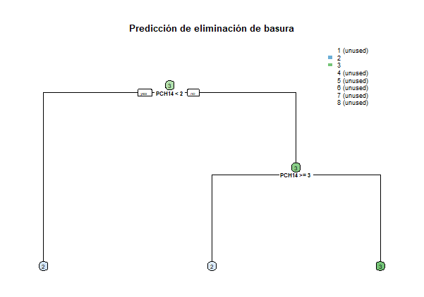
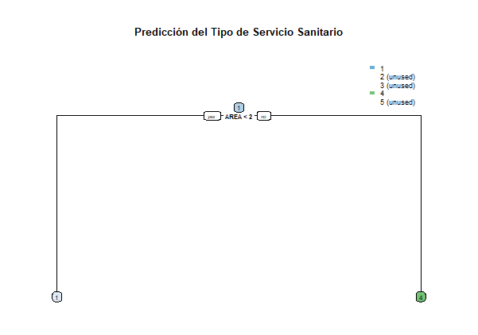

# MineriatT5_Arboles

Siguiendo al ejemplo de árboles de decisión, agregue una predicción del ceso de hogar o vivienda, tome como base el ejemplo desarrollado en clase que se encuentra en el repositorio ya publicado.
Se solicita lo siguiente:
Descripción del árbol realizado y gráficado.
Enlace de su repositorio de Github del código fuente donde se observe la implementación de los árboles de decisión.

Basandonos en estos campos: 

# árbol de decisión para predecir cómo eliminan la basura
pre_basura <- rpart(PCH10 ~
                        PCH9_A +
                        PCH9_C +
                        PCH9_F +
                        PCH13 +
                        PCH14,
                      data = hogar, method = "class")

# Graficar el árbol de decisión
rpart.plot(pre_basura, type=2, extra=0, under = TRUE, fallen.leaves = TRUE, 
           box.palette = "BuGn", main ="Predicción de eliminación de basura", cex = 0.5)

Se genero lo siguiente: 

donde: 

PCH14 son estas categorias 

    1	Gas propano
    2	Leña
    3	Electricidad
    4	Carbón
    5	Gas corriente
    6	Otra fuente
    7	No cocina

Si la condición es verdadera (PCH14 < 2): El modelo predice la categoría 2 LEÑA 
Si la condición es falsa (PCH14 >= 2): 
PCH14 >= 3:
Si esta condición es verdadera (PCH14 >= 3): El modelo predice la categoría Electricidad.
Si esta condición es falsa (PCH14 < 3 pero >= 2): El resultado predicho vuelve a ser Leña.

Para realizar el árbol de predicción de Sanitario 

# árbol de decisión para predecir cómo eliminan la sanitario
pre_sanitario <- rpart(PCH5 ~ 
                  AREA + 
                  ZONA + 
                  NUM_VIVIENDA + 
                  PCH1 + 
                  PCH3, 
                data = hogar, method = "class")

# Graficar el árbol de decisión
rpart.plot(pre_sanitario, type=2, extra=0, under=TRUE, fallen.leaves=TRUE, 
            box.palette="BuGn", main="Predicción del Tipo de Servicio Sanitario", cex=0.5)

Se genero lo siguiente: 

donde: 

AREA	1	Urbano
        2	Rural

AREA < 2:
Si esta condición es verdadera (AREA < 2): El modelo predice la categoría Urbano.
Si esta condición es falsa (AREA >= 2): El modelo predice la categoría Rural .